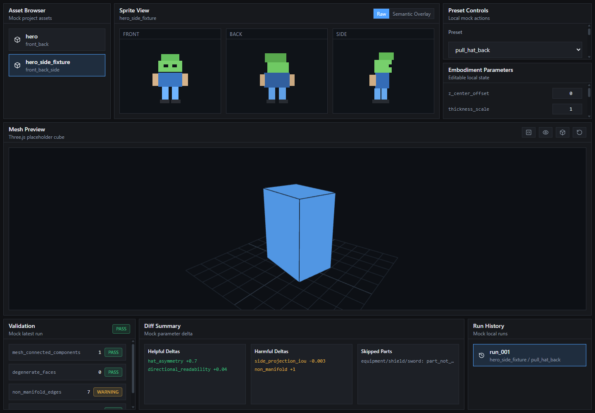

# SpriteSpatial Phase 9A Handoff: Studio Shell Frontend Foundation

## Status

Phase 9A is implemented and verified.

The repo now contains a standalone mock-only React/TypeScript/Vite frontend under:

```text
studio/
```

It proves the internal editor workflow without connecting to the Phase 8D backend and without adding ML, Godot UI, animation, rigging, new geometry, or new rendering logic.

## Exact Output Folder

```text
studio/
docs/handoffs/
```

## Screenshot



Screenshot file:

```text
docs/handoffs/phase9a_studio_shell.png
```

## Files Added or Changed

Frontend app:

```text
studio/package.json
studio/package-lock.json
studio/index.html
studio/README.md
studio/tsconfig.json
studio/tsconfig.node.json
studio/vite.config.ts
studio/vitest.setup.ts
studio/postcss.config.js
studio/tailwind.config.ts
studio/src/main.tsx
studio/src/index.css
studio/src/pages/Studio.tsx
```

Mock data and state:

```text
studio/src/api/mockStudioApi.ts
studio/src/hooks/useStudioState.ts
studio/src/mock/studioMock.ts
studio/src/types/studio.ts
```

Components:

```text
studio/src/components/AssetBrowser.tsx
studio/src/components/DiffSummary.tsx
studio/src/components/EmbodimentParametersPanel.tsx
studio/src/components/MeshViewer.tsx
studio/src/components/Panel.tsx
studio/src/components/PresetPanel.tsx
studio/src/components/RunHistory.tsx
studio/src/components/SpriteInspector.tsx
studio/src/components/StatusBadge.tsx
studio/src/components/ValidationPanel.tsx
```

Tests:

```text
studio/src/components/AssetBrowser.test.tsx
studio/src/components/PresetPanel.test.tsx
studio/src/components/ValidationPanel.test.tsx
studio/src/components/DiffSummary.test.tsx
```

Placeholder visual assets:

```text
studio/public/placeholders/front.svg
studio/public/placeholders/back.svg
studio/public/placeholders/side.svg
```

## Structure

```text
studio/
  src/
    api/
    components/
    hooks/
    pages/
    types/
    mock/
  public/
  package.json
```

## Implemented Workflow

- Browse mock assets.
- Select `hero` or `hero_side_fixture`.
- Inspect front/back/side placeholder sprites.
- Toggle raw vs semantic overlay mock mode.
- Select mock embodiment preset.
- Adjust local preset intensity.
- Apply preset into local UI state.
- Edit embodiment parameter fields locally.
- View mock validation metrics with PASS/WARNING badges.
- View mock helpful/harmful/skipped diff summary.
- Select mock run history.
- Preview a placeholder Three.js cube with orbit controls, wireframe toggle, front view, side view, and back view.

## Commands Run

```powershell
cd studio
npm install
npm run test
npm run build
```

Vite dev server was launched locally and probed:

```powershell
npm run dev -- --port 5173
Invoke-WebRequest http://127.0.0.1:5173
```

Screenshot capture used Chrome headless against the local dev server:

```powershell
chrome.exe --headless=new --disable-gpu --window-size=1440,1000 --screenshot=docs/handoffs/phase9a_studio_shell.png http://127.0.0.1:5173
```

## Verification Result

Passed:

```text
npm install
npm run test
npm run build
local Vite dev server HTTP probe
```

Test result:

```text
4 test files passed
4 tests passed
```

Build result:

```text
Vite production build completed successfully.
```

## Commands Deliberately Not Run

```text
Backend API connection
Godot
API visual judge
SpriteSpatial reconstruction commands
```

## Known Warnings and Caveats

`npm install` reported four moderate npm audit findings in the frontend dependency tree. No forced dependency upgrade was applied because Phase 9A is a frontend shell task and `npm audit fix --force` can introduce breaking churn.

Vite reported a chunk-size warning because Three.js is bundled into the first shell. This is not a functional failure. Future phases can split the mesh viewer into a lazy chunk if startup size matters.

The UI is intentionally desktop-first and internal. It is not responsive mobile product UI.

All data is mocked. The app does not call `studio_api/` yet.

The mesh viewer loads a placeholder cube, not `mesh.json`.

No save logic exists for embodiment parameters.

## Key Validation Metrics

```text
asset selection test: passed
preset selection/apply test: passed
validation render test: passed
diff render test: passed
Vite build: passed
dev server probe: HTTP 200
```

## Pass/Fail Result

PASS.

Phase 9A succeeds structurally: the app launches, the dark editor layout exists, all requested panels exist, mock data flows through local state, the Three.js viewer works, and tests pass with no backend dependency.

## Recommended Next Engineering Step

Phase 9B should connect this shell to the Phase 8D local Studio API behind a small typed client, while keeping mock mode available as a fallback. The first useful integration points are `/assets`, `/presets`, `/apply-preset`, `/run-diff`, and `/runs`.

## Handoff Checklist

- [x] Studio app created under `studio/`
- [x] React + TypeScript + Vite configured
- [x] Tailwind configured
- [x] Three.js placeholder viewer implemented
- [x] Asset Browser implemented
- [x] Sprite Inspector implemented
- [x] Preset Panel implemented
- [x] Embodiment Parameters Panel implemented
- [x] Diff Summary implemented
- [x] Validation Panel implemented
- [x] Run History implemented
- [x] Required tests added
- [x] `npm install` completed
- [x] `npm run test` passed
- [x] `npm run build` passed
- [x] `npm run dev` launched and returned HTTP 200
- [x] Screenshot captured
- [x] Backend intentionally not connected
