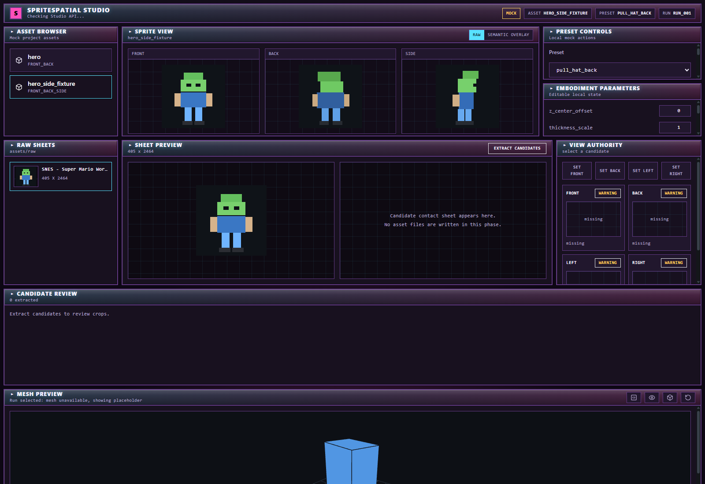

# SpriteSpatial Phase 9C Handoff: Raw Sheet Browser + Candidate Review

## Status

Phase 9C is implemented and verified.

The local Studio can now browse raw PNG sprite sheets, preview a selected sheet, call the existing candidate extractor through the Studio API, review extracted crops, and assign local front/back/left/right roles. This phase does not create assets, write selected sprites, run reconstruction builds, call AI ranking by default, or touch Godot.

## Screenshot



Screenshot file:

```text
docs/handoffs/phase9c_sheet_browser_candidate_review.png
```

The screenshot was captured in mock fallback mode so it uses placeholder sheet imagery. The backend endpoints and real candidate extraction were validated separately through API tests.

## Backend Endpoints Added

```text
GET  /raw-sheets
GET  /file?path=<relative_path>
POST /view-candidates
```

### `GET /raw-sheets`

Lists PNG sheets under:

```text
assets/raw/
```

Returns sheet id, filename, relative path, dimensions, and byte size.

### `GET /file`

Safely serves image files for browser display.

Allowed roots:

```text
assets/raw/
assets/samples/
outputs/
```

Rejected:

```text
absolute paths
..
non-image extensions
paths outside allowed roots
```

### `POST /view-candidates`

Request:

```json
{
  "sheet_path": "assets/raw/SNES - Super Mario World - Playable Characters - Mario.png",
  "asset_id": "mario",
  "max_candidates": 320,
  "ai_rank": false
}
```

Implementation shells out to the existing:

```text
tools/find_view_candidates.py
```

No extraction logic was rewritten. AI ranking remains opt-in and is not used by the Studio UI.

Response includes:

```text
run_id
out_dir
candidate_contact_sheet
candidate_report
candidates[]
```

## Frontend Added

API wrapper:

```text
studio/src/api/sheets.ts
```

Components:

```text
studio/src/components/SourceSheetBrowser.tsx
studio/src/components/SourceSheetPreview.tsx
studio/src/components/CandidateGrid.tsx
studio/src/components/ViewAssignmentPanel.tsx
```

Tests:

```text
studio/src/components/SourceSheetBrowser.test.tsx
studio/src/components/CandidateGrid.test.tsx
studio/src/components/ViewAssignmentPanel.test.tsx
```

## Frontend Modified

```text
studio/src/api/client.test.ts
studio/src/api/mockStudioApi.ts
studio/src/api/studioApi.ts
studio/src/hooks/useStudioState.ts
studio/src/mock/studioMock.ts
studio/src/pages/Studio.tsx
studio/src/pages/Studio.workflow.test.tsx
studio/src/types/studio.ts
```

The UI keeps the existing Studio shell and adds a compact Phase 9C band:

```text
Raw Sheets
Sheet Preview
View Authority
Candidate Review
```

## Backend Modified

```text
studio_api/main.py
studio_api/models.py
studio_api/services.py
test_studio_api.py
```

`studio_api/services.py` now normalizes API-relative paths to forward slashes so browser clients do not receive Windows backslash paths.

## Workflow Now Available

From Studio:

1. Select a raw sheet from `assets/raw/`.
2. Preview the sheet.
3. Click `Extract Candidates`.
4. Review extracted candidates.
5. Select a candidate.
6. Assign it to `front`, `back`, `left`, or `right`.
7. Review local authority summary:

```text
authored
placeholder
missing
```

Assignments are local browser state only in Phase 9C.

## Files Generated During Validation

API smoke generated candidate output under:

```text
outputs/mario/view_candidates/20260531T134536Z_mario_sheet_candidates/
```

The smoke report was updated:

```text
outputs/studio_api/smoke_test/api_smoke_report.json
```

## Commands Run

Backend:

```powershell
python tools\validate_project.py --skip-godot
python -m unittest test_studio_api.py
python -m unittest test_build_topological_sprite_model.py
```

Frontend:

```powershell
cd studio
npm run test
npm run build
```

Screenshot capture:

```powershell
cd C:\dev\SpatialSprite\studio
npm run dev -- --port 5173 --strictPort
```

Then Chrome headless captured:

```text
docs/handoffs/phase9c_sheet_browser_candidate_review.png
```

## Validation Results

Passed:

```text
python tools\validate_project.py --skip-godot
python -m unittest test_studio_api.py
python -m unittest test_build_topological_sprite_model.py
npm run test
npm run build
```

Frontend test result:

```text
9 test files passed
13 tests passed
```

Backend API test result:

```text
5 tests passed
```

`npm run build` still reports the known Vite chunk-size warning from bundling Three.js. This is not a failure.

## Commands Not Run

```text
Godot
API visual judge
AI candidate ranking
asset creation
semantic mask editing
reconstruction build jobs from Studio
mesh loading changes
```

## Known Limitations

Phase 9C stops before asset creation. Selected candidates are not copied into `assets/samples/`.

There is no persistence for front/back/left/right assignments yet. Refreshing the page loses the selection.

The authority summary is intentionally simple:

```text
assigned once -> authored
same candidate assigned to multiple views -> placeholder
unassigned -> missing
```

The UI does not yet detect true mirrored placeholders. That belongs in Phase 9D/9E when selections are saved and validated as source coverage.

The mesh viewer remains the existing placeholder cube. Phase 9C does not load `mesh.json`.

## Recommended Phase 9D Work

Implement asset creation from reviewed candidates:

```text
POST /assets/from-candidates
AssetCreationPanel
spriteasset_v1 writer
front/back/left/right copy with explicit confirmation
source_coverage writer
default embodiment params writer
semantic_overrides bootstrap
```

Phase 9D should persist the assignments currently held in local UI state and create a proper editable asset folder under:

```text
assets/samples/<asset_id>/
```

## Pass/Fail

PASS.

Phase 9C now supports raw sheet browsing, safe image serving, candidate extraction through the existing tool, candidate review, and local canonical view assignment without adding new geometry, ML, Godot, or asset-writing behavior.
