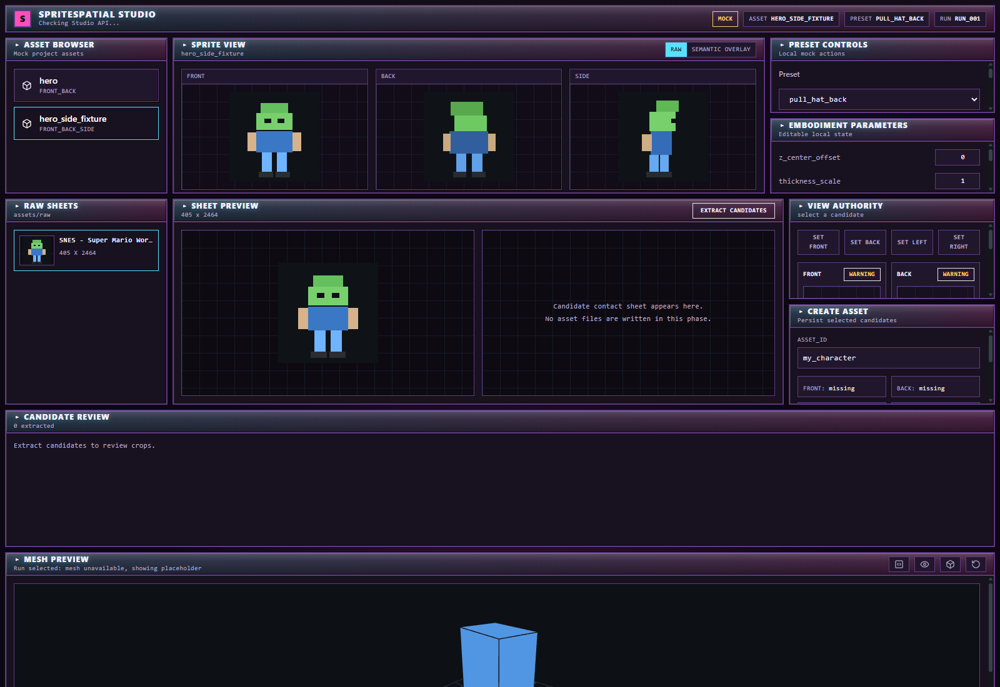

# SpriteSpatial Phase 9D Handoff: Asset Creation From Candidate View Assignments

## Status

Phase 9D is implemented and verified.

The Studio workflow can now persist Phase 9C candidate assignments into a real SpriteSpatial asset folder under:

```text
assets/samples/<asset_id>/
```

This phase only writes an asset package. It does not add reconstruction logic, geometry systems, build jobs, mesh preview work, Godot, ML, semantic mask painting, animation, or rigging.

## Screenshot



Screenshot file:

```text
docs/handoffs/phase9d_asset_creation.png
```

## Endpoint Added

```text
POST /assets/from-candidates
```

Request:

```json
{
  "asset_id": "my_character",
  "candidate_run_dir": "outputs/mario/view_candidates/...",
  "selection": {
    "front": 0,
    "back": 1,
    "left": 2,
    "right": 3
  },
  "source_coverage": {
    "front": "authored",
    "back": "authored",
    "left": "authored_side",
    "right": "authored_side"
  }
}
```

Response:

```json
{
  "ok": true,
  "asset_id": "my_character",
  "asset_dir": "assets/samples/my_character",
  "spriteasset_path": "assets/samples/my_character/spriteasset_v1.json",
  "created_files": []
}
```

## Backend Behavior

Implemented in:

```text
studio_api/main.py
studio_api/models.py
studio_api/services.py
```

Rules enforced:

```text
asset_id must be lowercase letters, numbers, and underscore only
front candidate is required
candidate_run_dir must resolve under outputs/
candidate files must exist
existing assets are not overwritten
missing back/left/right are allowed and marked missing
```

Created package:

```text
assets/samples/<asset_id>/
  front.png
  back.png optional
  left.png optional
  right.png optional
  spriteasset_v1.json
  embodiment_params_default.json
  embodiment_params.json
  semantic_overrides/
```

Semantic overrides are bootstrapped as transparent PNGs matching `front.png` size:

```text
outline.png
head.png
face.png
hat_hair.png
torso.png
left_arm.png
right_arm.png
left_leg.png
right_leg.png
boots_feet.png
equipment.png
```

## Frontend Added

```text
studio/src/components/AssetCreationPanel.tsx
studio/src/components/AssetCreationPanel.test.tsx
```

## Frontend Modified

```text
studio/src/api/assets.ts
studio/src/api/studioApi.ts
studio/src/hooks/useStudioState.ts
studio/src/pages/Studio.tsx
studio/src/pages/Studio.workflow.test.tsx
studio/src/types/studio.ts
```

The Create Asset panel shows:

```text
asset_id input
front/back/left/right selected candidate ids
missing back warning
missing side warning
duplicate assignment warning
success/error state
```

On successful live creation:

```text
asset list refreshes
new asset is selected automatically
created asset path is displayed
```

Mock mode still works without the backend.

## Tests Added

Backend tests in:

```text
test_studio_api.py
```

Coverage:

```text
create asset from candidate fixture succeeds
unsafe asset_id rejected
missing front rejected
duplicate existing asset rejected
spriteasset_v1.json exists
asset appears in GET /assets
semantic_overrides masks are created
embodiment params files are created
```

Frontend tests:

```text
studio/src/components/AssetCreationPanel.test.tsx
studio/src/pages/Studio.workflow.test.tsx
```

Coverage:

```text
invalid asset id disables button
missing front disables button
valid front selection enables button
create callback fires
missing back/side warnings render
mock workflow can assign candidates and create a mock asset
```

## Commands Run

Backend:

```powershell
python tools\validate_project.py --skip-godot
python -m unittest test_studio_api.py
python -m unittest test_build_topological_sprite_model.py
```

Frontend:

```powershell
cd studio
npm run test
npm run build
```

Screenshot capture:

```powershell
cd studio
npm run dev -- --port 5173 --strictPort
```

Then Chrome headless captured:

```text
docs/handoffs/phase9d_asset_creation.png
```

## Validation Results

Passed:

```text
python tools\validate_project.py --skip-godot
python -m unittest test_studio_api.py
python -m unittest test_build_topological_sprite_model.py
npm run test
npm run build
```

Backend API tests:

```text
8 tests passed
```

Frontend tests:

```text
10 test files passed
16 tests passed
```

`npm run build` still emits the known Vite chunk-size warning due to Three.js. This is not a functional failure.

## Commands Deliberately Not Run

```text
Godot
API visual judge
AI candidate ranking
reconstruction builds from Studio
mesh preview loading
semantic mask painting
asset overwrite tests beyond rejection
```

## Generated Validation Output

The API tests generated temporary candidate outputs under:

```text
outputs/mario/view_candidates/
```

Temporary test assets were cleaned up after tests:

```text
assets/samples/studio_test_asset_9d
assets/samples/studio_test_duplicate_9d
```

The smoke report was updated:

```text
outputs/studio_api/smoke_test/api_smoke_report.json
```

## Known Limitations

The UI still does not persist assignment state until Create Asset is clicked.

There is no overwrite mode. Existing asset ids return an error.

Semantic override masks are empty transparent placeholders. Actual semantic mask authoring remains future work.

The asset package is valid but not automatically built. Build job integration is intentionally deferred.

The view authority logic is simple:

```text
assigned front -> authored
assigned back -> authored
assigned side -> authored_side
duplicate side candidate -> placeholder
unassigned view -> missing
```

## Recommended Phase 9E

Build Job Integration:

```text
POST /jobs/build-asset
GET /jobs
GET /jobs/{job_id}
BuildPanel
ValidationReportPanel
artifact links
```

The next useful step is letting Studio run the existing editor-safe build pipeline for a newly created asset and display validation output without requiring terminal commands.

## Pass/Fail

PASS.

Phase 9D now lets Studio create a real asset folder from selected candidate sprites, bootstrap required files, refresh the asset browser, and preserve the strict no-geometry/no-Godot/no-ML boundary.
